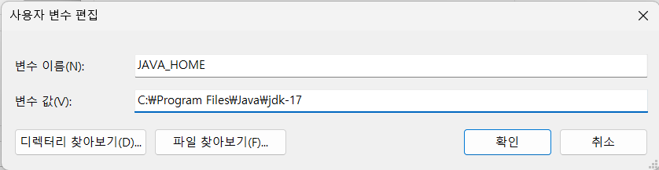
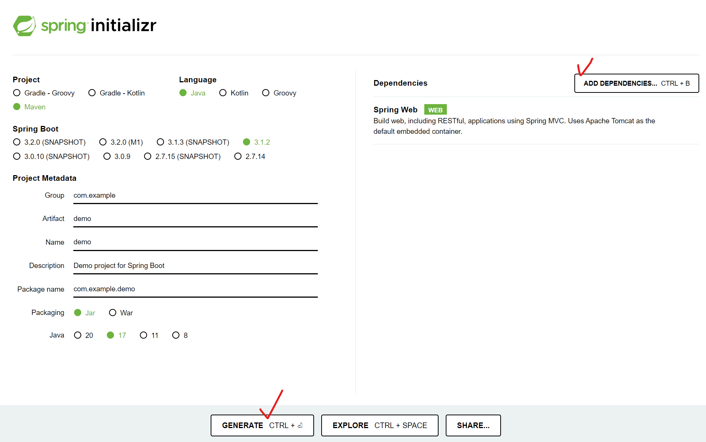
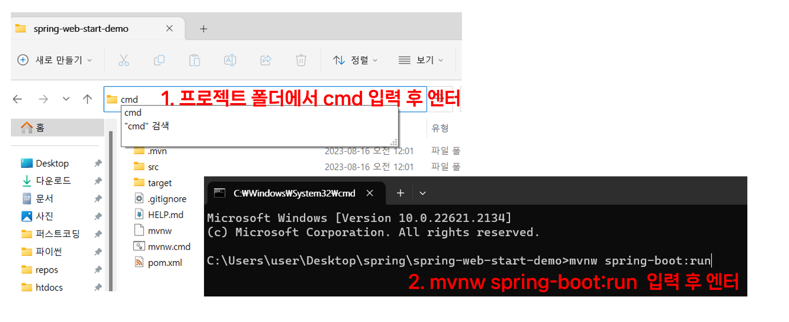
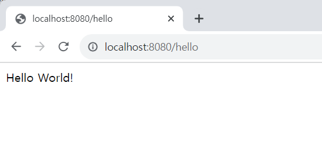

# Java 환경 설정 및 Spring Boot 구동시켜보기

Spring 공식 사이트에서 소개하는 방법으로 Spring Boot 프로젝트를 만들고 구동시켜보자.

## 1. (사전 준비) JDK 다운로드 및 설치
 - JDK 다운로드: https://www.oracle.com/java/technologies/javase/jdk17-archive-downloads.html
 - JAVA_HOME 환경변수 등록 (Windows)
 - 내 컴퓨터(속성) → 고급 시스템 설정 -> 환경변수
 - 새로 만들기 후 아래와 같이 JDK 설치 경로 지정

    

 - Java 버전 확인(cmd창): `java -version`
<br><br><br>
---
# 2. 개발 툴 설치
 
 Spring 프로젝트를 개발하기 위한 통합 개발환경(IDE)는 IntelliJ IDEA, Spring Tools, Visual Studio Code, Eclipse등이 있다. <br>

 본 실습에서는 IntelliJ IDEA와 VS Code를 사용하기로 한다.
  - IntelliJ IDEA : Java 및 Spring 개발
    - 다운로드: https://www.jetbrains.com/ko-kr/idea/download/?section=windows
    - Community 버전의 경우 무료이지만 Spring 프로젝트를 사용함에 있어 제약이 있다. (프로젝트 생성 시 귀찮음)
  - Visual Studio Code : 가벼운 코드 편집기 및 웹 개발용도로 사용 
    - 다운로드: https://code.visualstudio.com/download
<br><br><br>
---

# 3. Spring Boot 프로젝트 생성
 - Spring 공식 사이트 참고: https://spring.io/quickstart
 - 프로젝트 생성은 Spring Initializr 활용: https://start.spring.io/

    
 - Project - Maven선택
 - ADD DEPENDENCIES 클릭 후 Spring Web 추가
 - 설정 후 GENERATE 클릭하면 프로젝트 파일이 다운로드 된다.
<br><br><br>
# 4. 코드 수정
 - 프로젝트 파일의 압축을 풀고 `src/main/java/com/example/demo`경로에 보면 `DemoApplication.java` 파일이 있다.
 - 해당 파일을 열어보면 다음과 같이 Java어플리케이션의 시작 부분을 확인할 수 있다.
    ```java
    public static void main(String[] args) {
        SpringApplication.run(DemoApplication.class, args);
    }
    ```
 - 아래와 같이 코드를 수정해보자.
    ```java
    package com.example.demo;
    import org.springframework.boot.SpringApplication;
    import org.springframework.boot.autoconfigure.SpringBootApplication;
    import org.springframework.web.bind.annotation.GetMapping;
    import org.springframework.web.bind.annotation.RequestParam;
    import org.springframework.web.bind.annotation.RestController;

    @SpringBootApplication
    @RestController
    public class DemoApplication {
        public static void main(String[] args) {
        SpringApplication.run(DemoApplication.class, args);
        }
        @GetMapping("/hello")
        public String hello(@RequestParam(value = "name", defaultValue = "World") String name) {
        return String.format("Hello %s!", name);
        }
    }
    ```
<br><br><br>
# 5. 프로젝트 구동
 - spring.io/quickstart 사이트에 소개 된 예시는 Gradle 기준
 - Maven 프로젝트는 다음과 같이 어플리케이션을 구동시킬 수 있다.
 - 프로젝트 폴더에서 cmd창을 띄운다.
 - 다음 명령어로 실행
    ```
    mvnw spring-boot:run
    ```
    

 - `Started DemoApplication in 1.42 seconds (process running for 1.692)`과 같은 메시지가 나타나면 정상적으로 구동된 것이다.
 - 브라우저에서 다음 주소로 접속해보자. http://localhost:8080/hello

    
 - 접속 주소 뒤에 다음과 같이 쿼리 파라미터를 붙여보자 `?name=Spring`
    ```
    http://localhost:8080/hello?name=Spring
    ```
    