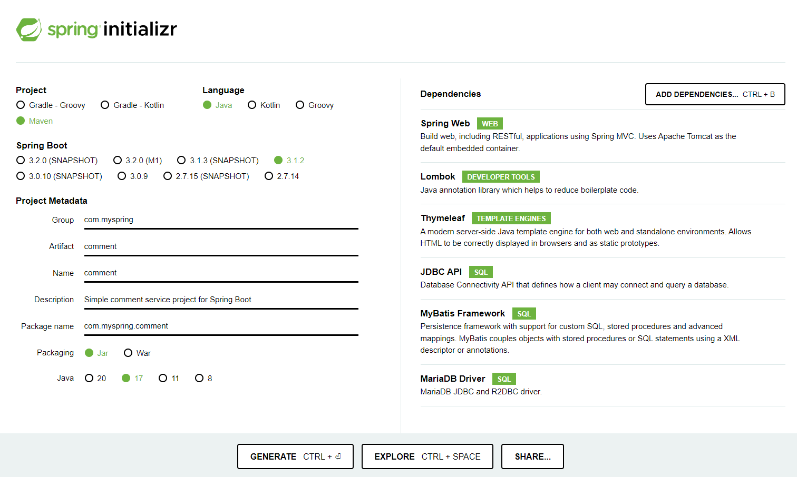
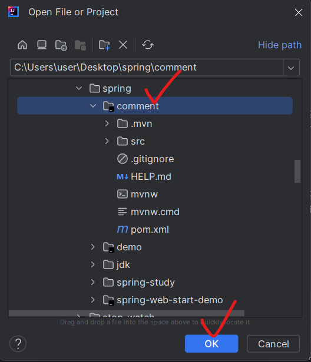
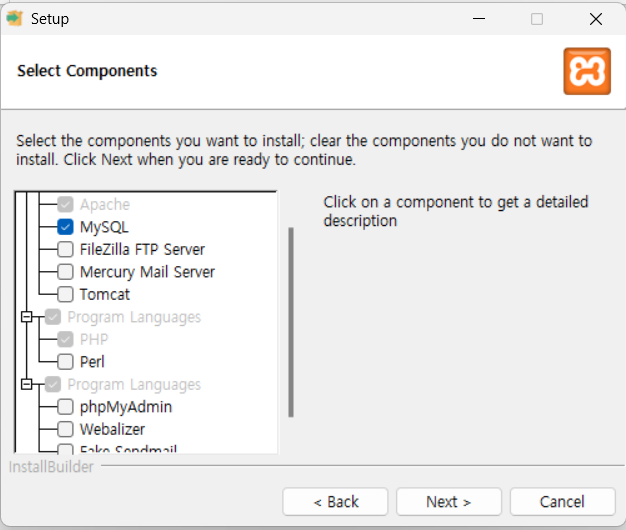

# Spring Boot 개발 환경 설정 및 프로젝트 생성

## IntelliJ IDEA 기본 설정

### 플러그인 설치
 - File → Settings → Plugins → Marketplace탭에서 다음 플러그인 검색 후 Install
   - Lombok
     - Java 데이터 모델 객체의 Getter, Setter 자동 생성 (객체의 getXXX(), setXXX() 메소드를 `@Data` 어노테이션만 붙이면 자동 생성할 수 있다.)
   - MybatisX
     - Mybatis 사용 시 데이터베이스 조작을 위한 SQL쿼리(Mapper)와 Java Interface간 소스코드를 Jump할 수 있도록 해준다. (개발 편의성)
   - Spring Boot Assistant
     - Spring Boot 프로젝트의 설정 파일(application.yml) 작성 시 자동완성 제공. (개발 편의성)

### 기본 설정
  - 설정 파일의 한글 깨짐 방지를 위해 다음 설정
  - File → Settings → Editor → File Encodings: Default encoding for properties files → UTF-8로 선택
  - Transparent native-to-ascii conversion 체크
<br><br>
---
## IntelliJ IDEA Community 버전에서의 프로젝트 생성
 - IntelliJ IDEA Community버전은 Spring 프로젝트 생성에 제약이 있다.
 - (구매 여력이 있다면 Ultimate버전 사용 시 모든 귀찮은 문제 해결, IDE내에서 바로 프로젝트 생성이 가능하다. 대학생 인증 시 무료 사용가능)
 - 따라서 Spring 공식 사이트의 프로젝트 생성 툴을 이용한다.

### Spring Boot 프로젝트 생성
 - https://start.spring.io 접속
 - Project: Maven
 - Language: Java
 - Spring Boot: 3.1.2
 - Project Metadata: 프로젝트에 맞게 이름 설정
   - Group과 Package name은 자바 어플리케이션을 구분하는 고유값 같은것 (안드로이드 apk 설치 시 패키지명으로 동일한 앱 인식하는 원리)
   - 다른(타사의) 어플리케이션과 중복 되지 않게 지정한다.
   - 주로 회사의 경우 도메인 역순으로 지정 
 - Packaging: Jar
 - Java: 17
 - Dependencies: 다음 목록의 기술들을 추가한다.
   - Spring Web: Spring 웹 MVC 사용을 위해 톰캣 서버를 포함한다.
   - Thymeleaf: View(화면-HTML) 표현을 위한 템플릿 엔진
   - JDBC API: Java에서 데이터베이스 접속을 위한 API
   - MariaDB Dirver: JDBC와 MariaDB(MySql)를 연결해주는 드라이버
   - MyBatis Framework: 자바의 객체와 데이터베이스 SQL을 연동시켜주기 위한 프레임워크
   - Lombok: 데이터 객체의 Getter, Setter를 자동 생성해줌

   
 - GENERATE 버튼 클릭 시 생성된 프로젝트 파일이 압축 파일(.zip)로 다운로드 된다.

### 프로젝트 열기
 - 다운 받은 프로젝트 파일의 압축을 푼 후 프로젝트 관리용으로 사용할 폴더로 이동시킨다.
 - IntelliJ IDE의 File-Open메뉴 클릭

    

### 프로젝트 사전 환경설정 (데이터베이스 설치)
#### MySql 데이터베이스 설치
 - MySql(MariaDB) 데이터베이스 사용을 위한 설치 (Windows 기준)
 - 실습을 위한 Mysql Server 구축 시 초기 설정 과정이 번거로으므로 XAMPP를 이용하면 간단히 설정해서 실습해볼 수 있다.
 - XAMPP 다운로드: https://www.apachefriends.org/
 - XAMPP 설치 시 MySql외의 나머지 옵션은 체크 해제한다.
   
 - 설치 완료 후 MySQL 옆의 Start버튼을 클릭하여 데이터베이스를 구동한다.
  

#### 데이터베이스 관리를 위한 프로그램 설치 (MySql Workbench)
 - 데이터베이스에 접속해서 테이블 생성 및 자료 관리를 위해 MySql Workbench 프로그램을 설치한다.
 - [MySql Workbench 다운로드](https://www.firstcoding.kr/deepweb/mysql_workbench.zip)
 - Mysql Workbench 설치 후 처음 DB 접속 정보 설정<br>
  
 - (+)버튼 클릭
 - 다음과 같이 설정
   - ConnectionName: 관리하려는 DB용도에 맞게 적당한 이름으로 설정
   - Hostname: 현재의 PC에서 구동되고 있으므로 127.0.0.1
   - Port: MySql 접속 포트 (기본: 3306)
   - Username: 데이터베이스 접속 ID (기본 root)
   - Password: 데이터베이스 접속 PW (기본-설정되어있지 않다.)
   
 - Test Connection을 눌러 접속이 되는지 확인

#### 데이터베이스 설정 (스키마, 테이블 생성)
 - Create new scheme 버튼 클릭

     
 - Name에는 프로젝트 성격에 맞도록 데이터베이스명을 입력한다.
 - Charset은 utf8로 설정

    

 - 하단의 Apply버튼 클릭 후 창이 뜨면 Apply클릭
 - 데이터베이스가 생성되었으면 테이블을 생성한다.

    
 - 간단한 댓글 서비스 실습을 위해 다음과 같이 테이블 구조를 생성해보자

    

### 프로젝트 설정
 - IntelliJ에서 SpringBoot 프로젝트를 설정한다.

#### pom.xml
  - pom.xml은 Maven의 빌드 정보를 담고 있는 파일, POM(Project Object Model)은 프로젝트 내 빌드 옵션및 의존성을 관리한다.
  - 다른 프로젝트에도 복사-붙여넣기하여 사용할 수 있기에 범용성이 좋고, 협업할때에 버전을 통일하기에 편리하다.
    ```
    Maven은 자바 프로젝트를 관리하는 툴로, 미리 작성된 xml 파일을 이용하여 라이브러리를 자동으로 다운로드하거나 프로젝트를 빌드해준다. 즉, 자바 소스를 컴파일하고 패키지해서 deploy까지 자동화해주는 도구이다.
    ```
  - 추가 하고싶은 기능이 있을 경우 pom.xml파일의 `<dependencies>...</dependencies>` 부분에 추가해준다.
  - 프로젝트 생성 시 필요한 기본 기능들을 dependencies로 선택했기 때문에 이미 추가되어 있는것을 볼 수 있다.

#### application.yml
 - 스프링 프로젝트의 환경 설정 파일이다.
 - src → main → resources 폴더 내의 `application.properties`파일을 `application.yml`로 변경한다. 
 - (메뉴 → Refactor → Rename)

    ```
    application.properties 파일로 사용해도 되지만 설정 내용이 많아질 경우 계층 구조로 표현되는 yml파일이 좀 더 가독성 및 유지관리에 좋다.
    ```
 - 아래와 같이 설정 파일을 작성한다.

    ```yml
    spring:
      profiles:
        active: local
      #thymeleaf 설정
      thymeleaf:
        check-template-location: true
        prefix: classpath:/templates/   # .html 파일 경로 (src/main/resources/templates)
        suffix: .html   # 확장자
        cache: false # default: true, 개발 시에는 false로 두는 것이 좋음
      mvc:
        static-path-pattern: /static/** # spring mvc 정적 파일들의 경로 (css, js파일 등)
      datasource:
        driver-class-name: org.mariadb.jdbc.Driver
        url: jdbc:mariadb://127.0.0.1:3306/spring_db # spring_db 부분은 설정한 DB명과 맞춘다.
        username: root
        #password: password # 비밀 번호가 있을 경우 설정한다.
    mybatis:
      mapper-locations:
        - classpath:mappers/*.xml
      configuration:
        map-underscore-to-camel-case: true # (DB)value_name -> (Java)valueName 자동 매핑
    server:
      servlet:
        context-path: /
      port: 8081 # 웹 서버의 포트 번호
    ```

#### 실행 설정 (IntelliJ)
 - Run → Edit Configrations
 - (+)버튼 또는 Add new run configration 클릭
 - Application 선택
 - Name: 적절한 이름 입력 (ex: SpringBootApp)
 - Build and run
   - 설치된 JDK 선택 
   - 우측 Main Class 선택 (main()함수가 있는 클래스를 선택해준다.)

### 프로젝트 구동
 - 실행 버튼(▷)을 클릭 (Shift + F10)
 - 우측 하단 `Lombok requires enabled annotation processing` 경고가 뜨면 Enable annotation processing을 클릭해준다.
 - 로그 화면에 다음과 같이 뜨면 구동에 성공한 것이다.
    ```
    .   ____          _            __ _ _
    /\\ / ___'_ __ _ _(_)_ __  __ _ \ \ \ \
    ( ( )\___ | '_ | '_| | '_ \/ _` | \ \ \ \
    \\/  ___)| |_)| | | | | || (_| |  ) ) ) )
    '  |____| .__|_| |_|_| |_\__, | / / / /
    =========|_|==============|___/=/_/_/_/
    :: Spring Boot ::                (v3.1.2)

    .... 어쩌고 로그들...

    CommentApplication    : Started CommentApplication in 3.124 seconds (process running for 5.44)
    ```
  - 웹브라우저(크롬 등)에서 http://localhost:8081/ 페이지로 접속해본다.
  - 요청을 처리할 Controller 코드가 없기 때문에 Whitelabel Error Page가 뜨게 된다.

### Controller 만들고 호출해보기
 - src → java → com..(패키지명).. 폴더 클릭
 - 메뉴 → New → Package 클릭
 - 패키지명 끝에 `controller` 붙인 후 엔터
 - 생성된 controller 폴더 클릭
 - 메뉴 → New → Java Class 클릭
 - `MainController` 입력 후 엔터
 - 다음과 같이 코드를 작성한다.

    ```java
    package com.myspring.comment.controller;

    import org.springframework.web.bind.annotation.RequestMapping;
    import org.springframework.web.bind.annotation.RequestMethod;
    import org.springframework.web.bind.annotation.RequestParam;
    import org.springframework.web.bind.annotation.RestController;

    @RestController
    public class MainController {
        @RequestMapping(value = "/", method = RequestMethod.GET)
        public String hello(@RequestParam(value = "name", defaultValue = "World") String name) {
            return String.format("Hello %s!", name);
        }
    }
    ```
  - 다시 실행 (Shift+F10)
  - Process... Is Running 창이 뜨면 Stop and Rerun 클릭
  - 브라우저에서 http://127.0.0.1:8081/ 접속해보자
  - Hello World! 글자가 화면에 나타나면 Spring Boot 서버가 정상적으로 구동된 것이다!
