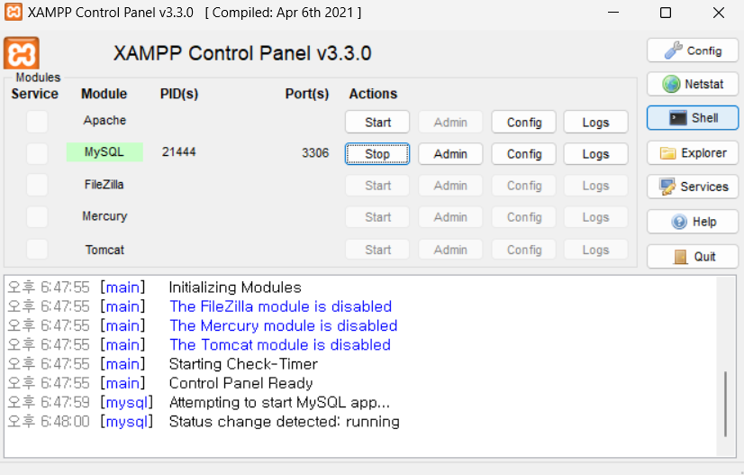

# MySQL DB 사용자 추가



 - XAMPP 제어판의 Shell버튼을 눌러 CMD창을 띄운다.
 - 다음 명령어로 Mysql 클라이언트Shell 실행
  
    ```
    mysql -u root -p
    ```

 - 초기 root패스워드는 비어있으므로 비밀번호 입력 없이 그냥 엔터

 - 다음과 같이 입력한다.

### mysql DB 선택

```sql
USE mysql;
```

### 현재 유저 테이블 상태 확인

```sql
SELECT host, user, password FROM user;
```

### DB user 생성

```sql
#CREATE USER '아이디'@'localhost' IDENTIFIED BY '비밀번호';

CREATE USER 'spring'@'localhost' IDENTIFIED BY 'spring-pw'; 
flush privileges;
```

> 오류 발생(XAMPP버그 추정) 시 cmd에서 다음 명령어로 테이블들을 복구한다.
> ```bash
>mysqlcheck -u root -p --auto-repair --check --all-databases
>```


### user에 권한 부여
 - DB명.테이블명 형식
 - `*.*` 지정 시 모든 DB의 모든 테이블에 권한을 준다.
```sql
GRANT ALL PRIVILEGES ON *.* TO 'spring'@'localhost';
```

### DB 외부접속 설정
```sql
GRANT ALL PRIVILEGES ON *.* TO 'spring'@'%' identified BY 'spring-pw';
flush privileges;
```

### 권한 확인
```sql
SELECT host, user, password FROM mysql.user;
```

이후 MySQL서버를 재시작 하여 생성한 user로 접속

### 유저 삭제하기
```sql
DROP USER 'spring';
DROP USER 'spring'@'localhost';
flush privileges;
```