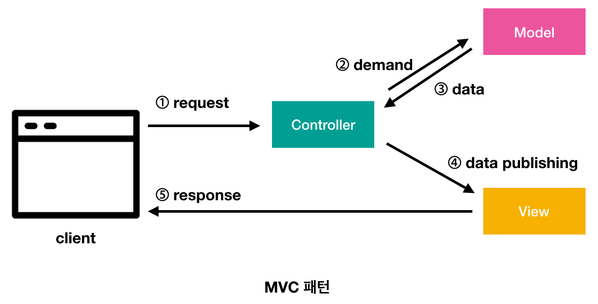

# Controller 작성과 View 연결

## Controller의 역할 (MVC패턴)
스프링 프레임워크는 MVC(Model-View-Controller)패턴을 사용하고있고, 여기서 Controller는 화면(View)과 비즈니스 로직(Model)를 연결시키는 다리 역할을 한다.



`http://사이트주소/어떤페이지`와 같은 요청이 올 때 `/어떤페이지` 부분의 요청을 Controller가 처리하여 적절한 View를 응답하도록 연결한다.

이전에 작성한 MainController.java 파일을 살펴보자.

```java
@RestController
public class MainController {
    @RequestMapping(value = "/", method = RequestMethod.GET)
    public String hello(@RequestParam(value = "name", defaultValue = "World") String name) {
        return String.format("Hello %s!", name);
    }
}

```

 - MainController 클래스에 붙은 `@RestController`어노테이션을 통해 MainController클래스가 Controller 역할을 하는 것임을 설정한다.
 - 일반적으로 View를 지정하려면 `@Controller`를 사용한다. 자바 객체를 바로 Json 형태의 데이터를 반환하기 위해 사용하는것이 `@RestController`이다.
 - `@RequestMapping(value = "/", method = RequestMethod.GET)`: 요청 메서드와 path를 지정한다. `value="/hello"`로 지정 시 `http://서버주소/hello` 요청을 처리한다.
 - `method = RequestMethod.GET`: 화면을 조회하는 요청은 주로 GET이다. 데이터를 보내는(업로드) 요청의 경우 주로 POST를 사용한다.
 - [Http Method](https://developer.mozilla.org/en-US/docs/Web/HTTP/Methods) 참고 

## View(화면)와 템플릿
 - View는 화면을 구성하는 HTML과 같은 코드(프론트엔드)이다.
 - 자바 서버에서 데이터를 처리한 후 적절한 화면을 표현하기 위해 동적으로 HTML을 생성해야할 필요가 있다.
 - (예: 댓글 목록을 표시하기 위해 Java에서 데이터베이스의 댓글 목록을 조회한 후 HTML의 Table태그로 찍어낸다.)
 - 이때 HTML과 같은 코드를 동적으로 생성하기 위해 사용하는 것이 템플릿 엔진이다.
 - Java Spring에서 사용되는 템플릿 엔진에는 JSP, Thymeleaf등이 있다.

    

## Thymeleaf 설정하기
 - 본 프로젝트에서는 View 템플릿 엔진으로 Thymeleaf를 활용한다.
 - Thymeleaf 공식 사이트: https://www.thymeleaf.org
 - pom.xml 파일에 다음 내용을 확인한다. (없으면 추가)
  
  ```xml
  <dependencies>
    ...
    <dependency>
      <groupId>org.springframework.boot</groupId>
      <artifactId>spring-boot-starter-thymeleaf</artifactId>
    </dependency>
    ...
  </dependencies>
  ```
 - pom.xml파일을 수정했으면 maven reload를 수행해준다.
  
    

 - src → main → resources → application.yml 설정 파일에 다음 내용을 확인한다. (없으면 추가)
  
    ```yml
    spring:
      #thymeleaf 설정
      thymeleaf:
        check-template-location: true
        prefix: classpath:/templates/   # .html 파일 경로 (src/main/resources/templates)
        suffix: .html   # 확장자
        cache: false # default: true, 개발 시에는 false로 두는 것이 좋음
    ```
 - 이제 실제 View가 될 HTML 파일을 만들어보자.
 - src → main → resources → templates 폴더 아래에 `main.html` 파일을 생성한다.

    
 - 다음과 같이 대략 내용을 확인할 수 있도록 페이지를 작성한다.
    ```html
    <!DOCTYPE html>
    <html lang="ko">
    <head>
        <meta charset="UTF-8">
        <title>메인 페이지</title>
    </head>
    <body>
        <h1>안녕하세요~ 뷰입니다~</h1>
    </body>
    </html>
    ```
## Controller와 View 연결
  - 위에서 작성한 MainController를 다음과 같이 수정해보자.
  - `@RestController` → `@Controller`로 변경
  - `String hello()` 메서드의 return 값을 위에서 생성한 html파일 이름(`main`)으로 지정
  - (suffix설정을 하였으므로 확장자는 생략한다.)
    ```java
    @RequestMapping(value = "/", method = RequestMethod.GET)
      public String hello(@RequestParam(value = "name", defaultValue = "World") String name) {
          return "main";
      }
    ```
 - 어플리케이션 재시작(Shift+F10) 후 http://127.0.0.1:8080/ 접속해본다.
 - 위에서 만들었던 html페이지가 열리는지 확인

    

## View로 데이터 전달하기
 - Java쪽 Controller에서 View로 데이터를 전달하여 화면에 나타나게 해보자.
 - Controller 코드를 다음과 같이 수정한다.

    ```java
    @RequestMapping(value = "/", method = RequestMethod.GET)
      public String hello(@RequestParam(value = "name", defaultValue = "World") String name, Model model) {
          model.addAttribute("message", "안녕하세요!");
          return "main";
      }
    ```
 - View html(main.html)의 body부분을 다음과 같이 수정한다.

    ```html
    <h1 th:text="${message}">안녕하세요~ 뷰입니다~</h1>
    ```
 - 어플리케이션을 재실행 후 페이지를 호출해보면 `model.addAttribute("message", "안녕하세요!");`를 통해 넘어간 데이터가 View에 표시되는것을 확인할 수 있다.
