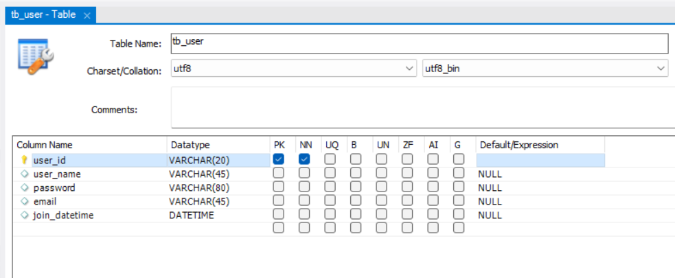

# Spring Security

스프링 시큐리티(Spring Security)는 인증 (Authentication), 권한(Authorize) 부여 및 보호 기능을 제공하는 프레임워크이다. 이를 통해 간편하게 로그인 및 인증(권한부여)관련 기능을 구현할 수 있다.

- https://spring.io/projects/spring-security

### 인증(Authentication) , 인가(Authorization)
 - 인증: 해당 사용자가 본인이 맞는지를 확인하는 절차. (로그인)
 - 인가: 인증된 사용자가 요청된 자원에 접근가능한가를 결정하는 절차. (로그인한 사용자가 어떤 권한이 있는가)

### Spring Security의 특징

 - 보편적으로 인증은 username - password 패턴의 인증방식을 거치기 때문에 스프링 시큐리티는 principal - credential 패턴을 가지게 된다.
 - Filter를 기반으로 동작한다.
 - Spring MVC와 분리되어 관리하고 동작할 수 있다.
 - Bean으로 설정할 수 있다. (Spring Security 3.2부터는 XML설정을 하지 않아도 된다.)

## SpringSecurity 적용해보기
 Simple 댓글 서비스에 로그인 기능 추가를 위해 Spring Security를 적용해보자

### 프로젝트에 추가
 - 다음 maven의존성을 pom.xml에 추가한다. (`<dependencies>...</dependencies>`사이에 추가)
 - thymeleaf 관련 기능도 추가하여 템플릿 엔진에서 시큐리티 관련 기능을 사용할 수 있다.

    ```xml
    <dependency>
        <groupId>org.springframework.boot</groupId>
        <artifactId>spring-boot-starter-security</artifactId>
        <version>3.1.3</version>
    </dependency>
    <dependency>
        <groupId>org.thymeleaf.extras</groupId>
        <artifactId>thymeleaf-extras-springsecurity6</artifactId>
        <version>3.1.2.RELEASE</version>
    </dependency>
    ```

### SpringSecurity 설정
 - 의존성 추가 후 서버를 구동시키고 접속해보면 바로 로그인 화면을 볼 수 있다.
  
    
 - 그러나 아직 로그인 관련 설정과 인증 로직을 구현하지 않았으므로 로그인이 되지는 않는다.
 - 스프링 시큐리티는 기본적으로 인증되지 않은 사용자는 서비스를 사용할 수 없게 되어 있다.
 - 하지만 이러한 기본 기능을 그대로 적용하지 않고 시큐리티 설정을 통해 커스텀이 필요하다.

다음과 같이 설정 파일을 작성한다.
 - config패키지를 생성하고 `SecurityConfig.java`자바 클래스를 생성한다.

    ```java
    package com.myspring.comment.config;

    import com.myspring.comment.service.UserSecurityService;
    import org.springframework.context.annotation.Bean;
    import org.springframework.context.annotation.Configuration;
    import org.springframework.security.config.annotation.authentication.builders.AuthenticationManagerBuilder;
    import org.springframework.security.config.annotation.web.builders.HttpSecurity;
    import org.springframework.security.config.annotation.web.configuration.EnableWebSecurity;
    import org.springframework.security.crypto.bcrypt.BCryptPasswordEncoder;
    import org.springframework.security.crypto.password.PasswordEncoder;
    import org.springframework.security.web.SecurityFilterChain;
    import org.springframework.security.web.util.matcher.AntPathRequestMatcher;

    @Configuration
    @EnableWebSecurity
    public class SecurityConfig {

        @Bean
        SecurityFilterChain filterChain(HttpSecurity http) throws Exception {
            http
                    .authorizeHttpRequests((authorizeHttpRequests) -> authorizeHttpRequests
                            .requestMatchers(new AntPathRequestMatcher("/**")).permitAll())
                    .csrf((csrf) -> csrf
                            .ignoringRequestMatchers(new AntPathRequestMatcher("/**")))
                    .formLogin((formLogin) -> formLogin /* 로그인 Url 설정 */
                            .loginPage("/users/login")
                            .usernameParameter("userId")
                            .passwordParameter("password")
                            .defaultSuccessUrl("/"))
                    .logout((logout) -> logout
                            .logoutRequestMatcher(new AntPathRequestMatcher("/users/logout"))
                            .logoutSuccessUrl("/")
                            .invalidateHttpSession(true))
            ;
            return http.build();
        }

        // 비밀번호 해싱을 위한 BCryptPasswordEncoder Bean 등록
        @Bean
        PasswordEncoder passwordEncoder() {
            return new BCryptPasswordEncoder();
        }
    ```
 - @Configuration은 스프링의 환경설정 파일임을 의미하는 어노테이션이다.
 - @EnableWebSecurity는 모든 웹 요청 URL이 스프링 시큐리티의 제어를 받도록 만드는 어노테이션이다. (http 요청 시 내부적으로 SpringSecurityFilterChain이 동작하여 URL 필터가 적용)
 - 스프링 시큐리티의 세부 설정은 SecurityFilterChain 빈을 생성하여 설정할 수 있다. 
 - 다음 설정은 모든 인증되지 않은 요청을 허락한다는 의미이다. 따라서 로그인을 하지 않더라도 모든 페이지에 접근할 수 있다.

    ```java
    http
        .authorizeHttpRequests((authorizeHttpRequests) -> authorizeHttpRequests
            .requestMatchers(new AntPathRequestMatcher("/**")).permitAll())
        ;
    ```


### 회원 정보 (회원 가입) 구현

로그인 기능 구현을 위해서는 로그인할 사용자에 대한 설계가 필요하다. 간단하게 유저 정보를 담을 테이블을 만들고 관련 기능을 구현해보자.

 - 다음과 같이 tb_user 테이블을 설계한다.

    

 - 관련 Model(VO)객체 생성 (UserModel.java)

    ```java
    @Data
    public class UserModel {
        @Size(min = 3, max = 15)
        @NotEmpty(message = "사용자 ID는 필수 항목입니다.")
        private String userId;
        
        @Size(min = 2, max = 15)
        @NotEmpty(message = "사용자 이름은 필수 항목입니다.")
        private String userName;
        
        @Size(min = 4, max = 20)
        @NotEmpty(message = "비밀번호는 필수 항목입니다.")
        private String password;
        
        private String email;
        private LocalDateTime joinDatetime;
    }
    ```
 - User관련 DAO와 Mapper를 작성한다.

    ```java
    @Mapper
    public interface UserDAO {
        void insertUser(UserModel userModel);

        UserModel selectUser(@Param("userId") String userId);
    }

    ```

    ```xml
    <?xml version="1.0" encoding="UTF-8"?>
    <!DOCTYPE mapper PUBLIC "-//mybatis.org//DTD Mapper 3.0//EN" "http://mybatis.org/dtd/mybatis-3-mapper.dtd">

    <mapper namespace="com.myspring.comment.dao.UserDAO">

        <insert id="insertUser" parameterType="com.myspring.comment.model.UserModel">
            INSERT INTO tb_user (user_id, user_name, password, email, join_datetime)
            VALUES(#{userId}, #{userName}, #{password}, #{email}, now());
        </insert>

        <select id="selectUser" resultType="com.myspring.comment.model.UserModel">
            SELECT * FROM tb_user WHERE user_id = #{userId};
        </select>

    </mapper>
    ```
 - Service와 Controller도 구현한다.
  
    ```java
    @Service
    public class UserService {

        @Autowired
        private UserDAO userDAO;
        @Autowired
        private PasswordEncoder passwordEncoder;

        public void createUser(UserModel user) {
            String encodedPw = passwordEncoder.encode(user.getPassword());
            user.setPassword(encodedPw); // 패스워드는 해시하여 저장한다.

            userDAO.insertUser(user);
        }

        public UserModel getUser(String userId) {
            return userDAO.selectUser(userId);
        }
    }
    ```

    ```java
    @Controller
    public class UserContoller {

        @Autowired
        private UserService userService;

        // 회원가입 폼 화면
        @GetMapping(value = "/users/join")
        public String getJoinForm(Model model) {
            model.addAttribute("user", new UserModel());
            return "join_form";
        }

        // 회원 가입 등록 처리
        @PostMapping(value = "/users")
        public String postUser(@Valid UserModel user, Model model) {

            try {
                userService.createUser(user);
            } catch (DataIntegrityViolationException ex) {
                model.addAttribute("user", user);
                model.addAttribute("errMessage", "이미 사용중인 사용자 ID입니다.");
                return "join_form";
            }

            return "redirect:/";
        }

        // 로그인 form
        @GetMapping("/users/login")
        public String login() {
            return "login_form";
        }
    }
    ```
 - 회원 가입을 위한 form은 다음과 같이 작성하였다.
 - src/main/resources/templates 폴더에 join_form.html파일을 작성한다.

    ```html
    <!DOCTYPE html>
    <html lang="ko" xmlns:th="http://www.thymeleaf.org" xmlns:layout="http://www.ultraq.net.nz/web/thymeleaf/layout">
    <head>
        <meta charset="UTF-8">
        <meta name="viewport" content="width=device-width, initial-scale=1.0">
        <title>회원 가입</title>
        <link href="https://cdn.jsdelivr.net/npm/bootstrap@5.3.1/dist/css/bootstrap.min.css" rel="stylesheet" integrity="sha384-4bw+/aepP/YC94hEpVNVgiZdgIC5+VKNBQNGCHeKRQN+PtmoHDEXuppvnDJzQIu9" crossorigin="anonymous">
        <link href="https://fonts.googleapis.com/css2?family=Noto+Sans+KR:wght@100;300;400;500;700;900&display=swap" rel="stylesheet">
        <style>
            body { font-family: "Noto Sans KR", sans-serif; }
        </style>
        <script defer src="https://cdn.jsdelivr.net/npm/bootstrap@5.3.1/dist/js/bootstrap.bundle.min.js" integrity="sha384-HwwvtgBNo3bZJJLYd8oVXjrBZt8cqVSpeBNS5n7C8IVInixGAoxmnlMuBnhbgrkm" crossorigin="anonymous"></script>
    </head>
    <body>
    <nav th:replace="~{navbar :: navbarFragment}"></nav>
    <div class="my-5 mx-5">
        <h1 class="mb-5">회원 가입</h1>
        <form method="post" action="/users" th:object="${user}">
            <div class="mb-3">
                <label for="userId" class="form-label">아이디</label>
                <input th:field="*{userId}" type="text" class="form-control" name="userId" id="userId">
                <div class="form-text">사용하실 아이디를 정해주세요.</div>
            </div>
            <div class="mb-3">
                <label for="password" class="form-label">비밀번호</label>
                <input th:field="*{password}" type="password" class="form-control" name="password" id="password">
                <div class="form-text">비밀 번호를 설정해주세요.</div>
            </div>
            <div class="mb-3">
                <label for="userName" class="form-label">이름</label>
                <input th:field="*{userName}" type="text" class="form-control" name="userName" id="userName">
                <div class="form-text">이름을 입력해주세요.</div>
            </div>
            <div class="mb-3">
                <label for="email" class="form-label">이메일</label>
                <input th:field="*{email}" type="email" class="form-control" name="email" id="email">
                <div class="form-text">이메일 주소를 입력해주세요.</div>
            </div>

            <div class="alert alert-danger" role="alert" th:if="${!#strings.isEmpty(errMessage)}">
                <div th:text="${errMessage}"></div>
            </div>
            <div class="mb-3 text-end">
                <button class="btn btn-outline-secondary" type="submit">등록</button>
            </div>
        </form>
    </div>
    </body>
    </html>
    ```

 - 페이지 상단에 메뉴를 표시하기 위해 다음과 같이 thymeleaf fragment를 추가하였다.

    ```html
    <nav th:replace="~{navbar :: navbarFragment}"></nav>
    ```
 - 상단바를 나타나도록 적용하려면 navbar.html파일을 생성하고 다음과 같이 작성해두면 `th:replace`를 통해 페이지에 상단바를 삽입할 수 있다.

    ```html
    <nav th:fragment="navbarFragment" class="navbar navbar-expand-lg bg-dark border-bottom border-body" data-bs-theme="dark">
        <div class="container-fluid">
            <a class="navbar-brand" href="/">Simple 댓글 서비스</a>
            <button class="navbar-toggler collapsed" type="button" data-bs-toggle="collapse" data-bs-target="#navbar" aria-controls="navbar" aria-expanded="false" aria-label="Toggle navigation">
                <span class="navbar-toggler-icon"></span>
            </button>
            <div class="navbar-collapse collapse" id="navbar" style="">
                <ul class="navbar-nav me-auto mb-2 mb-lg-0">
                    <li class="nav-item">
                        <a class="nav-link active" aria-current="page" href="/">홈</a>
                    </li>
                    <li sec:authorize="!isAuthenticated()" class="nav-item">
                        <a class="nav-link" href="/users/join">회원가입</a>
                    </li>
                    <li sec:authorize="!isAuthenticated()" class="nav-item">
                        <a class="nav-link" href="/users/login">로그인</a>
                    </li>
                    <li sec:authorize="isAuthenticated()" class="nav-item">
                        <a class="nav-link" href="/users/logout">로그아웃</a>
                    </li>
                </ul>
                <span sec:authorize="isAuthenticated()" class="navbar-text">
                    <span th:text="${userName}"></span>
                    환영합니다.
                </span>
                <span sec:authorize="hasRole('ROLE_ADMIN')" class="navbar-text">
                    <span class="badge bg-danger ms-1">관리자</span>
                </span>
                <span sec:authorize="hasRole('ROLE_USER')" class="navbar-text">
                <span class="badge bg-secondary ms-1">회원</span>
                </span>
            </div>
        </div>
    </nav>
    ```
 - User관련 기능들과 View까지 모두 작성하였다면 http://localhost:8080/users/join 접속 시 다음과 같이 회원 가입 화면을 볼 수 있다.
 - 상단바 메뉴도 잘 나오는 것을 확인할 수 있다.
  
    

### 로그인과 로그아웃

회원 가입 단계에서 tb_user 테이블에 회원 정보를 저장했다. tb_user 테이블에 저장된 사용자명(사용자 ID)과 비밀번호로 로그인을 하려면 복잡한 단계를 거쳐야 한다. 하지만 스프링 시큐리티를 사용하면 이 단계를 보다 쉽게 진행할 수 있다.

 - 로그인, 로그아웃 URL 등록 - SecurityConfig.java에서 스프링 시큐리티에 로그인 URL을 등록한다.
 - (위 예시에서 SecurityConfig.java 생성 시 다음 내용이 이미 포함되어 있음)

    ```java
    @Bean
    SecurityFilterChain filterChain(HttpSecurity http) throws Exception {
        http
        .formLogin((formLogin) -> formLogin /* 로그인 Url 설정 */
                .loginPage("/users/login")
                .usernameParameter("userId")
                .passwordParameter("password")
                .defaultSuccessUrl("/"))
        .logout((logout) -> logout
                .logoutRequestMatcher(new AntPathRequestMatcher("/users/logout"))
                .logoutSuccessUrl("/")
                .invalidateHttpSession(true))
        ;
        return http.build();
    }
    ```
 - UserController에 로그인 페이지를 추가한다. (위 예시에서는 이미 포함됨)

    ```java
    @GetMapping("/users/login")
    public String login() {
        return "login_form";
    }
    ```
 - 로그인form의 템플릿(login_form.html)은 다음과 같이 작성하였다.

    ```html
    <!DOCTYPE html>
    <html lang="ko" xmlns:th="http://www.thymeleaf.org" xmlns:layout="http://www.ultraq.net.nz/web/thymeleaf/layout">
    <head>
        <meta charset="UTF-8">
        <meta name="viewport" content="width=device-width, initial-scale=1.0">
        <title>로그인</title>
        <link href="https://cdn.jsdelivr.net/npm/bootstrap@5.3.1/dist/css/bootstrap.min.css" rel="stylesheet"
            integrity="sha384-4bw+/aepP/YC94hEpVNVgiZdgIC5+VKNBQNGCHeKRQN+PtmoHDEXuppvnDJzQIu9" crossorigin="anonymous">
        <link href="https://fonts.googleapis.com/css2?family=Noto+Sans+KR:wght@100;300;400;500;700;900&display=swap"
            rel="stylesheet">
        <style>
            body { font-family: "Noto Sans KR", sans-serif; }
        </style>
        <script defer src="https://cdn.jsdelivr.net/npm/bootstrap@5.3.1/dist/js/bootstrap.bundle.min.js" integrity="sha384-HwwvtgBNo3bZJJLYd8oVXjrBZt8cqVSpeBNS5n7C8IVInixGAoxmnlMuBnhbgrkm" crossorigin="anonymous"></script>
    </head>
    <body>

    <nav th:replace="~{navbar :: navbarFragment}"></nav>

    <div class="my-5 mx-auto" style="max-width:800px;">
        <h1 class="mb-5">로그인</h1>

        <form th:action="@{/users/login}" method="post">
            <div th:if="${param.error}">
                <div class="alert alert-danger">
                    사용자ID 또는 비밀번호를 확인해 주세요.
                </div>
            </div>
            <div class="mb-3">
                <label for="userId" class="form-label">사용자 ID</label>
                <input type="text" name="userId" id="userId" class="form-control">
            </div>
            <div class="mb-3">
                <label for="password" class="form-label">비밀 번호</label>
                <input type="password" name="password" id="password" class="form-control">
            </div>
            <div class="mb-3 text-end">
                <button type="submit" class="btn btn-primary">로그인</button>
            </div>
        </form>
    </div>
    </body>
    </html>
    ```
- 시큐리티의 로그인이 실패할 경우에는 로그인 페이지로 다시 리다이렉트 된다. 
- 이 때 페이지 파라미터로 error가 함께 전달되는데, error가 전달될 경우 "사용자ID 또는 비밀번호를 확인해 주세요." 라는 오류메시지를 출력한다.

### 로그인 처리 로직

 여기까지 만들고 로그인을 시도해보면 아직 로그인이 되지 않는다.<br>
 로그인 인증을 처리할 로직을 정해주지 않았기 때문인데, **스프링 시큐리티가 DB에 있는 사용자 정보를 기준으로 로그인 할 수 있도록 커스텀**이 필요하다.

 - 데이터베이스에서 사용자를 조회하는 서비스(UserSecurityService)를 만들고 그 서비스를 스프링 시큐리티에 등록해보자.
 - 다음과 같이 UserSecurityService를 작성한다.
 - 이는 스프링 시큐리티의 UserDetailsService인터페이스를 상속하여 구현한다.

    ```java
    @Service
    public class UserSecurityService implements UserDetailsService {
        @Autowired
        UserDAO userDAO;

        @Override
        public UserDetails loadUserByUsername(String userId) throws UsernameNotFoundException {

            UserModel user = userDAO.selectUser(userId);

            if (ObjectUtils.isEmpty(user)) {
                throw new UsernameNotFoundException("사용자를 찾을 수 없습니다.");
            }

            List<GrantedAuthority> authorities = new ArrayList<>();

            if ("admin".equals(user.getUserId())) {
                authorities.add(new SimpleGrantedAuthority(UserRole.ADMIN.getValue()));
            } else {
                authorities.add(new SimpleGrantedAuthority(UserRole.USER.getValue()));
            }

            return new User(user.getUserId(), user.getPassword(), authorities);
        }
    }
    ```
 - 스프링 시큐리티는 인증 뿐만 아니라 권한도 관리한다. 
 - 따라서 인증후에 사용자에게 부여할 권한을 설정할 수 있도록 다음과 같이 ADMIN, USER 2개의 권한을 갖는 UserRole을 enum으로 작성하자.

    ```java
    @Getter
    @AllArgsConstructor
    public enum UserRole {
        ADMIN("ROLE_ADMIN"),
        USER("ROLE_USER");

        private String value;
    }
    ```

 - 다음과 같이 스프링 시큐리티가 위에서 커스텀한 UserSecurityService를 사용하도록 config를 적용한다. (수동 등록 시)
 - Service구현만 해놓으면 자동으로 등록됨

    ```java
    @Bean
    SecurityFilterChain filterChain(HttpSecurity http) throws Exception {
        http
                .userDetailsService(userSecurityService)
                // ...(중략)...
        ;
        return http.build();
    }
    ```
### 로그인 시 다른 메뉴 보여주기

로그인 시 메뉴에 [로그아웃]을, 로그아웃 시에는 [로그인] 링크를 표시해보자.

 - 참고: https://www.thymeleaf.org/doc/articles/springsecurity.html
 - 상단바 템플릿에 다음과 같은 부분이 있는데 스프링 시큐리티의 로그인 상태에 따라 다른 템플릿을 보여줄 수 있다.

    ```html
    <li sec:authorize="!isAuthenticated()" class="nav-item">
        <a class="nav-link" href="/users/join">회원가입</a>
    </li>
    <li sec:authorize="!isAuthenticated()" class="nav-item">
        <a class="nav-link" href="/users/login">로그인</a>
    </li>
    <li sec:authorize="isAuthenticated()" class="nav-item">
        <a class="nav-link" href="/users/logout">로그아웃</a>
    </li>
    ```
 - 로그인 사용자의 Role에 따른 권한은 다음과 같이 보여줄 수 있다.

    ```html
    <span sec:authorize="hasRole('ROLE_ADMIN')" class="navbar-text">
        <span class="badge bg-danger ms-1">관리자</span>
    </span>
    <span sec:authorize="hasRole('ROLE_USER')" class="navbar-text">
        <span class="badge bg-secondary ms-1">회원</span>
    </span>
    ```
 - 부가적인 사용자 정보 보여주기
   - 로그인 시 사용자 이름(userId)은 Conrtoller에서 Principal객체로 받아올 수 있다.
   - 로그인 id로 사용자 정보를 DB에서 select한 후 view로 전달한다.
  
    ```java
    @GetMapping("/comments")
        public String getAllCommentList(Principal principal, Model model) {

        if (principal != null) {
            model.addAttribute("user", userService.getUser(principal.getName()));
        }

        List<CommentModel> commentList = commentService.getAllCommentList();

        model.addAttribute("commentList", commentList);
        return "main";
    }

    ```

    ```html
    <span sec:authorize="isAuthenticated()" class="navbar-text">
        <span th:if="${user}" th:text="${user.userName}"></span>
        환영합니다.
    </span>
    ```
  - 그러나 매번 사용자의 정보를 Controller에서 일일이 설정하는 것은 번거로우므로 개선 방법을 고민해보자.

계속...
