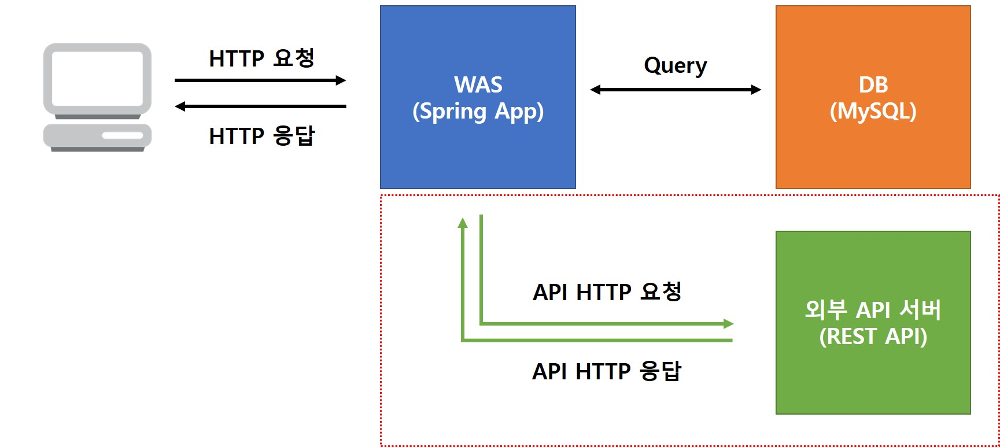

# RestTemplate

Spring어플리케이션에서 외부 API 호출 방법에 대해 알아보자.
외부 API 호출의 경우 외부 데이터를 제공 받아 결과를 응답할 때, 요청 데이터를 외부 서비스에 전달할 때와 같이 다양한 시나리오에 적용될 수 있다.

예) 유튜브 링크를 첨부하면 [Youtube Data API](https://developers.google.com/youtube/v3/guides/implementation/videos?hl=ko)를 호출하여 동영상의 상세 정보(제목, 썸네일, 플레이어 주소등)를 구해와 표시해줄 수 있을것이다.



## 스프링에서 외부 HTTP API를 호출하는 방법들

- HttpURLConnection/URLConnection
- HttpClient
- **RestTemplate**
- WebClient
- [OpenFeign](https://docs.spring.io/spring-cloud-openfeign/docs/current/reference/html/) ([참고- OpenFeign 소개 및 사용법](https://mangkyu.tistory.com/278))
 
### HttpURLConnection/URLConnection
 - 자바에서 제공하는 기본 API로 HTTP 통신이 가능하다.
 - 오래된 자바 버전, 동기적 통신을 기본으로 한다.
 - 요청을 보내고 받을 때까지 스레드가 대기 상태에 있다.
 - 기본적인 요청/응답 기능이 제공되지만 부가적인 기능들에 대해서 직접 구현해야 한다.

URLConnection을 이용한 GET구현 예시
```java
@Test
public void HttpUrlConnectionTest() throws Exception {
    Map<String, Object> map =  urlConnectionGet("https://reqres.in/api/users");
    System.out.println(map.toString());
}

public Map<String, Object> urlConnectionGet(String requestURL) throws Exception{
    URL url = new URL(requestURL);
    Map<String, Object> map = new HashMap<String, Object>();

    HttpURLConnection conn = (HttpURLConnection) url.openConnection(); // HTTP Connection 구하기
    conn.setRequestMethod("GET"); // 요청 Method 설정 ( 별도로 설정하지않으면 GET )
    conn.setConnectTimeout(3000); // 연결 타임아웃 설정
    conn.setReadTimeout(3000); // 읽기 타임아웃 설정

    System.out.println("getContentType():" + conn.getContentType()); // 응답 콘텐츠 유형
    System.out.println("getResponseCode():"    + conn.getResponseCode()); // 응답 코드
    System.out.println("getResponseMessage():" + conn.getResponseMessage()); // 응답 메시지

    // 응답 헤더의 정보를 모두 출력
    for (Map.Entry<String, List<String>> header : conn.getHeaderFields().entrySet()) {
        for (String value : header.getValue()) {
            System.out.println(header.getKey() + " : " + value);
        }
    }

    // 응답 내용(BODY) 구하기
    String json = "";
    try (InputStream inputStream = conn.getInputStream();
            ByteArrayOutputStream outputStream = new ByteArrayOutputStream()) {

        byte[] buf = new byte[1024 * 8];
        int length = 0;
        while ((length = inputStream.read(buf)) != -1) {
            outputStream.write(buf, 0, length);
        }

        json = new String(outputStream.toByteArray(), "UTF-8"); // 응답 결과 String
    }

    conn.disconnect(); // 접속 해제
    return stringToMap(json);
}

// Json 문자열을 Map객체로 변환하기 위한 메서드
private Map<String, Object> stringToMap(String json) {
    Map<String, Object> map = new HashMap<String, Object>();
    ObjectMapper mapper = new ObjectMapper(); // Json을 Map으로 변환
    try {
        map = mapper.readValue(json, Map.class);
    } catch (JsonProcessingException e) {
        e.printStackTrace();
    }

    return map;
}
```
### HttpClient
 - HTTP프로토콜을 쉽게 사용할 수 있도록 도와주는 Apache HTTP 컴포넌트
 - `HttpClient clent = HttpClientBuilder.create().build();`와 같이 간단하게 생성해서 사용할 수 있다.
 - URLConnection방식보다 코드가 간결하지만, 그래도 직접 구현해야 할 것이 많다.

구현하려면 pom.xml에 다음 의존성을 추가한다.
```xml
<dependency>
    <groupId>org.apache.httpcomponents</groupId>
    <artifactId>httpclient</artifactId>
    <version>4.5.14</version>
</dependency>
```

```java
@Test
public void httpClientGetTest() {
    Map<String, Object> map =  httpClientGet("https://reqres.in/api/users");
    System.out.println(map.toString());
}

public Map<String, Object> httpClientGet(String requestURL) {
    String resultBody = "";
    try {
        HttpClient client = HttpClientBuilder.create().build();
        HttpGet getRequest = new HttpGet(requestURL); //GET

        HttpResponse response = client.execute(getRequest);

        ResponseHandler<String> handler = new BasicResponseHandler();
        resultBody = handler.handleResponse(response); // 응답 Body
    } catch (Exception e){
        e.printStackTrace();
    }

    return stringToMap(resultBody);
}
```

### RestTemplate
 - Spring에 포함되어 있는 기능 (3.0에서 추가되었다.)
 - HttpClient를 추상화해서 제공한다.
 - HTTP요청 후 JSON, XML, String 과 같은 응답을 받을 수 있다.
 - 사용하기 쉽고 직관적이며 대부분 스프링 프로젝트에서 많이 사용된다.
 - 동기적인 HTTP 요청을 한다. (요청 후 응답까지 대기)
 - 비동기 요청 구현이 필요하다면 AsyncRestTemplate을 사용할 수 있다.
 - Deprecated되었다는 썰이 있었지만 공식적으로는 계속 지원한다고 한다. [참고](https://github.com/spring-projects/spring-framework/issues/24503)

다음과 같이 RestTemplate을 Bean으로 등록한다.
```java
@Configuration
public class ApplicationConfig {
    @Bean
    public RestTemplate restTemplate() {
        return new RestTemplate();
    }
}
```

RestTemplate을 활용한 GET요청 예시
```java
@Autowired
private RestTemplate restTemplate;

@Test
public void restTemplateGetTest() {
    ResponseEntity<HashMap> r =  restTemplate.getForEntity("https://reqres.in/api/users", HashMap.class);
    System.out.println(r.getBody().toString());
}
```

### WebClient
 - 스프링 5부터 도입된 웹 클라이언트 라이브러리
 - 비동기/논블로킹 방식으로 외부 API를 호출할 수 있다.
 - 웹플럭스(Webflux)를 추가해야만 사용할 수 있다. (웹플럭스 모듈이 통째로 추가된다, 작은 규모의 프로젝트에서는 부담)
 - 웹플럭스를 별도로 학습해야한다. (새로운 기술) [참고-배민 적용사례](https://techblog.woowahan.com/2667/)

WebClient를 이용한 GET예시
```java
@Test
public void webClientGetTest() {
    Map<String, Object> map =  webClientGet("https://reqres.in/api/users");
    System.out.println(map.toString());
}

public Map<String, Object> webClientGet(String requestUrl) {
    // webClient 기본 설정
    WebClient webClient = WebClient.builder().build();

    // api 요청
    return webClient
                    .get()
                    .uri(requestUrl)
                    .retrieve()
                    .bodyToMono(Map.class)
                    .block();
}
```

## RestTemplate 사용해보기


### RestTemplate 메서드
 - [RestTemplate 클래스 래퍼런스](https://docs.spring.io/spring-framework/docs/current/javadoc-api/org/springframework/web/client/RestTemplate.html)

|메서드|용도|설명
|-|-|-|
exchange(..)|any|지정된 HTTP 메서드를 URL에 대해 실행하며, Response body와 연결되는 객체를 포함하는 responseEntity를 반환한다.
execute(..)|any|지정된 HTTP 메서드를 URL에 대해 실행하며, Response body와 연결되는 객체를 반환한다.
getForEntity(..)|GET|HTTP GET 요청을 전송하며, Response body와 연결되는 객체를 포함하는 ResponseEntity를 반환한다.
getForObject(..)|GET|HTTP GET 요청을 전송하며, Response body와 연결되는 객체를 반환한다.
headForHeaders(..)|HEAD|HTTP HEAD 요청을 전송하며, 지정된 리소스 URL의 HTTP 헤더를 반환한다.
optionsForAllow(..)|OPTIONS|HTTP OPTIONS 요청을 전송하며, 지정된 URL의 Allow 헤더를 반환한다.
patchForObject(..)|PATCH|HTTP PATCH 요청을 전송하며, Response body와 연결되는 결과 객체를 반환한다.
postForEntity(..)|POST|URL에 데이터를 POST하며, Response body와 연결되는 객체를 포함하는 ResponseEntity를 반환한다.
postForLocation(..)|POST|URL에 데이터를 POST하며, 새로 생성된 리소스의 URL를 반환한다.
postForObject(..)|POST|URL에 데이터를 POST하며, Response body와 연결되는 객체를 반환한다.
put(..)|PUT|리소스 데이터를 지정된 URL에 PUT한다.
delete(..)|HTTP|지정된 URL의 리소스에 HTTP DELETE 요청을 수행한다.


## HTTP Method별 RestTemplate 사용 예시

### GET

**getForObject**<br>
HTTP GET요청 후 결과를 다음과 같이 객체로 맵핑 받아올 수 있다.

```java
@Test
public void restTemplateGet() {
    // 필요한 URL 파라미터를 다음과 같이 설정한다.
    Map<String, String> uriVariables = new HashMap<>();
    uriVariables.put("someParam1", "someValue1");
    uriVariables.put("someParam2", "someValue2");
    
    List<CommentModel> response = restTemplate.getForObject("http://localhost:8080/api/comments", List.class, uriVariables);
    System.out.println(response.toString());
}
```

**exchange**<br>
요청 시 헤더 정보를 추가하거나 좀 더 커스텀한 요청 형태를 만드려면 exchange메서드를 활용할 수 있다.

```java
@Test
public void restTemplateExchange() {
    String url = "http://localhost:8080/api/comments"; // API 주소(URL)

    // HTTP 요청 시 필요한 헤더를 다음과 같이 설정한다.
    HttpHeaders headers = new HttpHeaders();
    headers.set("Header1", "value1");
    headers.set("Header2", "value2");

    // 설정한 헤더와 함께 HTTP요청 객체인 requestEntity를 생성한다.
    HttpEntity<Void> requestEntity = new HttpEntity<>(headers);

    // HTTP요청 시 필요한 쿼리 파라미터를 다음과 같이 설정한다.
    Map<String, String> uriVariables = new HashMap<>();
    uriVariables.put("someParam1", "someValue1");
    uriVariables.put("someParam2", "someValue2");

    ResponseEntity<String> response = restTemplate.exchange(url, HttpMethod.GET, requestEntity, String.class, uriVariables);
    System.out.println(response.getBody().toString()); // API 응답 결과
}
```

### POST

**postForObject**<br>

EmailRequest 객체를 POST로 전송한 후 EmailResponse 객체로 응답 받는다.<br>
필요한 경우 HttpEntity객체에 필요한 헤더 정보와 body객체를 추가해 호출한다.<br>
객체가 직렬화 되어 실제로는 JSON문자열로 변환 되어 HTTP통신한다.

```java
@Data
@Builder
static class EmailRequest {
    private String to;
    private String subject;
    private String message;
}

@Data
static class EmailResponse {
    private String result;
    private String message;
}

@Test
public void postForObjectTest() {
    EmailRequest email = EmailRequest.builder()
            .to("gatexi7689@vip4e.com")
            .subject("메일 제목")
            .message("메일 내용")
            .build();

    HttpHeaders headers = new HttpHeaders();
    headers.set("X-Cipher", "(인증 헤더 값)");

    HttpEntity<EmailRequest> request = new HttpEntity<>(email, headers);
    EmailResponse result = restTemplate.postForObject("http://firstcoding.kr/api/examples/email/", request, EmailResponse.class);
    System.out.println(String.valueOf(result));
}
```

## RestTemplate 설정하기

앞서 프로젝트에서 RestTemplate을 사용하기 위해 다음과 같이 ApplicationConfig.java에 Bean으로 등록하였다.

```java
@Bean
public RestTemplate restTemplate() {
    return new RestTemplate();
}
```

다음과 같은 상황에 대응하기 위해 RestTemplate는 몇가지 설정을 적용해서 사용하는 것이 좋다.
 - 기본적인 RestTemplate의 타임아웃은 제한이 없는데, 이것은 문제의 소지가 있다.
 - RestTemplate으로 호출한 외부 API에 문제가 생겨 응답이 오지 않는 상황일 때, 모든 쓰레드가 RestTemplate으로 API를 호출하여 대기 상태에 빠진다면 다른 클라이언트 요청에 응답할 수 없게 된다. 
 - 이런 상황을 방지하기 위해 일정 시간이 지나도 응답이 없다면 연결을 강제로 끊도록 타임아웃을 설정한다.


RestTemplate을 세부적으로 설정하기 위해 다음과 같이 RestTemplateBuilder를 사용하여 생성 후 Bean등록할 수 있다.

```java
@Bean
public RestTemplate restTemplate(RestTemplateBuilder restTemplateBuilder) {
    return restTemplateBuilder
            .setConnectTimeout(Duration.ofSeconds(10)) // 연결 타임아웃 10초로 설정
            .setReadTimeout(Duration.ofSeconds(10))
            .build();
}
```

다음과 같이 모든 Http요청에 특정한 헤더(인증등)를 추가하도록 기본 헤더를 추가할 수 있다.

```java
@Bean
public RestTemplate restTemplate(RestTemplateBuilder restTemplateBuilder) {
    return restTemplateBuilder
            .setConnectTimeout(Duration.ofSeconds(10))
            .setReadTimeout(Duration.ofSeconds(10))
            .defaultHeader("X-Cipher", "(인증 값)") // HTTP 헤더값을 추가한다.
            .build();
}
```

# 실전 과제
## [Assignment 1] 유튜브 링크 파싱해서 동영상 추가하기

 - 댓글 또는 게시글에 유튜브 링크를 첨부하면 자동으로 동영상 정보를 불러와 게시글이 저장되도록 수정해보자.
 - 동영상 제목, 채널명, 플레이어 정보 표시
 - 아래의 힌트들을 적절히 활용


유튜브 동영상 주소의 형식은 다음과 같다
```
https://www.youtube.com/watch?v=RTVI8JYf9hU
https://youtu.be/RTVI8JYf9hU
https://youtu.be/RTVI8JYf9hU?feature=shared
```

>`RTVI8JYf9hU` 이 부분이 videoId에 해당한다.

다음은 유튜브 링크 및 videoId를 추출하는 예시이다.
```java
@Test
public void getYoutubeLinkTest() {
    String text = "글 본문 중에 유튜브 링크를 추출한다.\n" +
            "https://www.youtube.com/watch?v=RTVI8JYf9hU\n" +
            "https://youtu.be/RTVI8JYf9hU\n";

    System.out.println("Link: " + getYoutubeLink(text)); // 링크를 추출해온다.
    System.out.println("Id: " + getYouTubeId(getYoutubeLink(text))); // 비디오 id를 추출한다.
}

// 본문에서 유튜브 링크를 찾아 리턴
private  String getYoutubeLink(String text) {
    Pattern compiledPattern = Pattern.compile("http(?:s?):\\/\\/(?:www\\.)?youtu(?:be\\.com\\/watch\\?v=|\\.be\\/)([\\w\\-\\_]*)(&(amp;)[\\w\\=]*)?");
    Matcher matcher = compiledPattern.matcher(text);

    if(matcher.find()){
        return matcher.group();
    }

    return "";
}

// 유튜브 링크에서 비디오 id를 리턴
private String getYouTubeId(String youtubeUrl) {
    Pattern compiledPattern = Pattern.compile("(?<=youtu.be/|watch\\?v=|/videos/|embed\\/)[^#\\&\\?]*");
    Matcher matcher = compiledPattern.matcher(youtubeUrl);

    if(matcher.find()){
        return matcher.group();
    }

    return "";
}
```

동영상의 퍼가기(iframe) 시 HTML 소스코드는 다음과 같이 생성된다.
iframe이 동작하려면 Spring Security의 설정을 수정해야 할  수도 있다.

```html
<iframe width="560" height="315" src="https://www.youtube.com/embed/RTVI8JYf9hU?si=lyBk4Rpix4W5uJhq" title="YouTube video player" frameborder="0" allow="accelerometer; autoplay; clipboard-write; encrypted-media; gyroscope; picture-in-picture; web-share" allowfullscreen></iframe>
```

별도의 API신청 없이 유튜브 동영상의 정보를 가져오기 위한 방법으로 [Oembed](https://oembed.com/#section7) API를 활용할 수 있다.

> Oembed API를 활용하면 컨텐츠의 URL만으로 부가 정보를 획득할 수 있다.

유튜브의 Oembed API는 다음과 같이 호출할 수 있다.
 - https://www.youtube.com/oembed?url=https://www.youtube.com/watch?v=RTVI8JYf9hU

    ```json
    {
    "title": "학생 작품 소개: 아두이노로 개발한 도어락 시스템",
    "author_name": "퍼스트코딩",
    "author_url": "https://www.youtube.com/@firstcoding",
    "type": "video",
    "height": 113,
    "width": 200,
    "version": "1.0",
    "provider_name": "YouTube",
    "provider_url": "https://www.youtube.com/",
    "thumbnail_height": 360,
    "thumbnail_width": 480,
    "thumbnail_url": "https://i.ytimg.com/vi/RTVI8JYf9hU/hqdefault.jpg",
    "html": "<iframe width=\"200\" height=\"113\" src=\"https://www.youtube.com/embed/RTVI8JYf9hU?feature=oembed\" frameborder=\"0\" allow=\"accelerometer; autoplay; clipboard-write; encrypted-media; gyroscope; picture-in-picture; web-share\" allowfullscreen title=\"학생 작품 소개: 아두이노로 개발한 도어락 시스템\"></iframe>"
    }
    ```

## [Assignment 2] Youtube Data API 키를 획득해 API 호출하기

검색어를 파라미터로 받아 유튜브 동영상의 검색 결과를 json형태로 반환하는 REST API를 설계하고 구현해보자.
 - 1. API명세를 작성.
 - 2. 다음 제공되는 API를 활용하여 내가 설계한 API를 구현.
 - Youtube Data API 호출을 위해서는 API키를 발급해야 한다.
 - [Google API Console](https://console.cloud.google.com/apis/dashboard?hl=ko)에서 발급 신청 후 사용해야 하지만 다음 API를 통해 key를 구해서 호출하도록 한다.

**Youtube Data API 호출 Key 획득 API**
 - URL: `http://firstcoding.kr/api/examples/youtube`
 - Method: GET
 - 인증헤더: `X-Cipher` 헤더에 특정 문장을 URL인코딩 처리하여 포함 후 호출한다. (강사에게 문의)
    ```java
    HttpHeaders headers = new HttpHeaders();
    headers.set("X-Cipher", URLEncoder.encode("어떠한 문장", "UTF-8"));
    ```
 - 다음과 같은 형식으로 응답된다.

    ```json
    {
        "key": "(유튜브 API 호출에 필요한 Key 문자열)"
    }
    ```
 - 본 API는 강의 실습을 위한 테스트용 API(API Key)이므로 **실 서비스 개발 및 무분별한 사용은 금한다.**

**Youtube 검색 API**
  - URL: `https://www.googleapis.com/youtube/v3/search?part=id,snippet&q={검색어}&maxResults=10&key={위에서구한key문자열}`


## [Assignment 3] 글(또는 댓글)이 등록되면 email 알림 발송
 - 제공되는 테스트용 e-mail 발송 REST API를 활용하여 글 등록 시 email이 발송되게 한다.
 - 본 API는 강의 실습을 위한 테스트용 API이므로 **실 서비스 개발 및 무분별한 사용은 금한다.**
 - 테스트 시 naver, gmail등의 서비스는 스팸 필터에 의해 블록될 수 있으므로 [임시 이메일 서비스](https://temp-mail.org/ko/)등을 활용한다.

### 테스트용 e-mail 발송 API
 - URL: `http://firstcoding.kr/api/examples/email/`
 - Method: POST
 - 인증헤더: `X-Cipher` 헤더에 특정 문장을 URL인코딩 처리하여 포함 후 호출한다. (강사에게 문의)
 - 요청 Body 형식은 다음과 같다.
   - to: 수신자 메일 주소
   - subject: 메일 제목
   - message: 메일 본문 

    ```json
    {
        "to": "gatexi7689@vip4e.com",
        "subject": "테스트 제목",
        "message": "테스트 본문"
    }
    ```